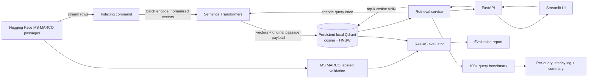

# Adrosonic Phase 1: Dense Retrieval for RAG

A runnable, dense-only baseline over the original MS MARCO passage collection. It uses Hugging Face Datasets for bounded streaming, a normalized Sentence Transformers encoder, persistent local Qdrant with cosine/HNSW search, FastAPI, Streamlit, and RAGAS evaluation. Passage texts remain the original corpus retrieval units.

## Requirements and setup

- Python 3.11 (3.12 is also allowed for local development), 8 GB+ RAM recommended, and enough disk for model files, the dataset cache, and Qdrant vectors.
- CPU runs are supported. An optional supported PyTorch accelerator can be selected with `DEVICE`.
- Network access is needed the first time to download the Hugging Face dataset and model.

```powershell
py -3.11 -m venv .venv
.\.venv\Scripts\Activate.ps1
python -m pip install --upgrade pip
python -m pip install -r requirements.txt
python -m pip install -e .
if (-not (Test-Path .env)) { Copy-Item .env.example .env }
```

The optimized candidate defaults to `Qwen/Qwen3-Embedding-0.6B`, 1024 dimensions, FP32, batch size 128, CPU, cosine search, and top 5. The prior `sentence-transformers/all-MiniLM-L6-v2` model is retained as `BASELINE_EMBEDDING_MODEL`, with a separate `BASELINE_COLLECTION_NAME`; existing baseline collections and reports are preserved. Qwen supports instructed queries and Matryoshka dimensions from 32 through 1024; the screening plan checks 1024, 768, 512, and 256. Its model card requires Transformers 4.51 or newer. See the [Qwen model card](https://huggingface.co/Qwen/Qwen3-Embedding-0.6B) for the supported model procedure and dimensions.

The existing `.env` contains `HUGGINGFACE_API_KEY`. Configuration now reads it as a masked secret and passes it to Hugging Face dataset and model downloads. I verified the token with Hugging Face's authenticated identity endpoint; only the success status was emitted. `.env` is ignored by Git, and `.env.example` contains an empty placeholder. Do not copy the token into source, logs, or reports. Public model and dataset downloads may also work without a token, subject to Hub rate limits.

Change `EMBEDDING_MODEL`, `EMBEDDING_DIMENSION`, `EMBEDDING_PRECISION`, `QUERY_INSTRUCTION`, `MODEL_REVISION`, `BATCH_SIZE`, `COLLECTION_NAME`, `DATA_LIMIT`, `DEVICE`, `TOP_K`, and paths as needed. `EMBEDDING_DIMENSION=0` uses the model-native dimension. On CPU, FP16/BF16 requests fall back to FP32; GPU mixed precision should be used only on supported hardware. The default PyTorch install is CPU; for CUDA, install a compatible PyTorch build before setting `DEVICE=cuda`. The full corpus contains about 9.85 million rows and needs substantially more disk/time than screening.

## Index passages

```powershell
python -m adrosonic_retrieval.indexer
```

The default source is `sentence-transformers/msmarco-corpus`, config `passage`, split `train`; it exposes stable `pid` and original `text` fields. Streaming and batched encoding bound working memory. Numeric passage IDs are preserved as Qdrant point IDs; rerunning safely upserts the same IDs. The collection schema is checked before ingestion. Reports are written under `OUTPUT_DIR` (default `artifacts/`). Use `DATA_LIMIT=100000` for the baseline; increase it toward 9,852,739 for a full corpus run.

## Launch API and UI

Run these in separate terminals (embedded Qdrant is local persistent storage; avoid running indexer and API concurrently against the same path):

```powershell
uvicorn adrosonic_retrieval.api:app --host 127.0.0.1 --port 8000
streamlit run src/adrosonic_retrieval/ui.py
```

API routes: `POST /search`, `GET /health`, and `GET /index/status`. Example:

```powershell
Invoke-RestMethod -Method Post -Uri http://127.0.0.1:8000/search -ContentType 'application/json' -Body '{"query":"what causes tides?","top_k":5}'
```

Response shape:

```json
{"query":"what causes tides?","results":[{"passage_id":"7349777","text":"...original passage...","score":0.73,"source":"sentence-transformers/msmarco-corpus","metadata":{"dataset_config":"passage","dataset_split":"train"},"retrieval_mode":"dense"}],"latency_ms":31.2,"retrieval_mode":"dense"}
```

Scores and example latency above illustrate response format only; they are not measured benchmark results. The actual endpoint returns real collection results or an explicit error.

## Evaluation and benchmark

```powershell
python -m adrosonic_retrieval.evaluate
python -m adrosonic_retrieval.benchmark --queries 100
python -m adrosonic_retrieval.experiment_runner --list
python -m adrosonic_retrieval.experiment_runner --experiment qwen-1024-batch64 --run --queries 100
```

Install optional evaluation dependencies before the RAGAS command: `python -m pip install -r requirements-eval.txt`. Evaluation uses MS MARCO v1.1 validation rows with human answers and selected passage contexts. It checks which labeled reference passages are already present in the current Qdrant collection, then evaluates only queries with at least one matching indexed reference; the report records this coverage and marks shortfalls as partial. This permits evaluation of an existing partial index without reindexing, but results are filtered to that subset and do not represent full-corpus performance. RAGAS Context Precision uses its non-LLM reference-context metric. Context Recall is unavailable without an LLM judge or aligned passage-ID qrels, and is recorded as such. For an LLM-based semantic Context Recall, an explicit evaluator integration can be added later; it is not needed for retrieval.

The controlled experiment runner reads `experiments/phase1_screening.json`. It uses a separate collection and output folder per experiment, writes raw query latencies plus indexing/benchmark summaries, and creates a timestamped result manifest. Listing is safe and does not download files; `--run` performs model/data downloads and a 10k screening run. The full acceptance run should rerun the selected configuration with `DATA_LIMIT=100000`. No screening results are populated until the experiments are actually run. INT8 quantization was not enabled because no Qwen index or quality baseline is available to measure its effect.

Benchmark captures every measured query with `perf_counter_ns`, including embedding and Qdrant timings, and reports p50/p95/p99/mean/min/max. In-process latency includes encoding, Qdrant, and result conversion; excludes API/HTTP serialization. The model is initialized before timed calls, so this is a warm benchmark. Reports in `reports/` are honest status snapshots; generated `artifacts/` files contain the actual results after local runs.

## Tests

```powershell
python -m pytest -q
```

Tests use fake embedding vectors and temporary local Qdrant collections. They cover dimensions, top 5, output format, empty/malformed requests, schema validation, persistence, and FastAPI responses without downloading the large corpus or model.

## Architecture and data flow



At API startup, one embedding model and one local Qdrant client are initialized and reused. Ingestion writes points in batches to the persistent collection; queries create one normalized query vector and perform one approximate nearest-neighbor request. The evaluator and benchmark call the same framework-independent retrieval service used by the API.

## Troubleshooting

- **Missing collection:** run indexing first; `/health` reports `index_missing` and search returns HTTP 503.
- **Dimension/distance mismatch:** choose a new `COLLECTION_NAME` when changing the encoder. Existing incompatible schemas fail explicitly.
- **Dataset/model download failure:** check network access and available disk; Hugging Face caches are controlled by the standard HF environment variables.
- **Slow CPU indexing:** each batch logs when processing starts and when it completes. Reduce `BATCH_SIZE` if a batch takes too long or RAM is constrained, or use an available accelerator. Actual throughput is hardware-specific; inspect `indexing_report.json`.
- **Embedded Qdrant lock:** close API before ingestion and avoid two processes opening one local database path at once.
- **RAGAS API or scoring issue:** the exact evaluation exception should be retained in terminal output; the report remains unavailable until a valid run completes.

## Current measured evidence

See [indexing report](reports/indexing_report.md), [benchmark report](reports/benchmark_report.md), [evaluation report](reports/evaluation_report.md), and [optimization report](reports/optimization_report.md). Fixture validation now has ten passing tests (`pytest 8.3.4`, `qdrant-client 1.13.3`). The Hub credential was verified, but the full ML stack installation stalled while unpacking PyTorch and was stopped. Qwen model loading, indexing, experiment runs, RAGAS scores, and latency figures remain unmeasured.
